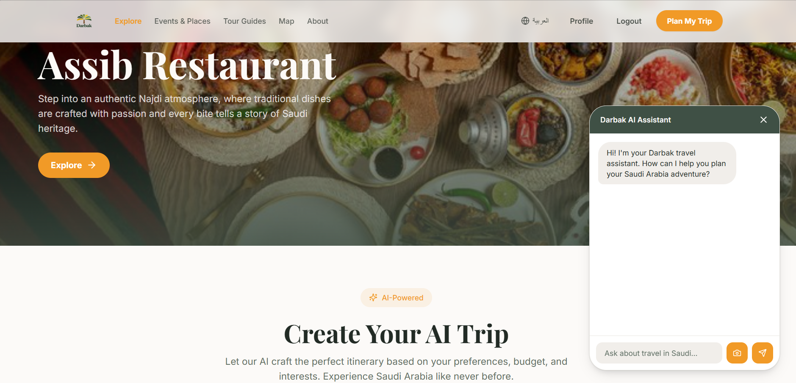
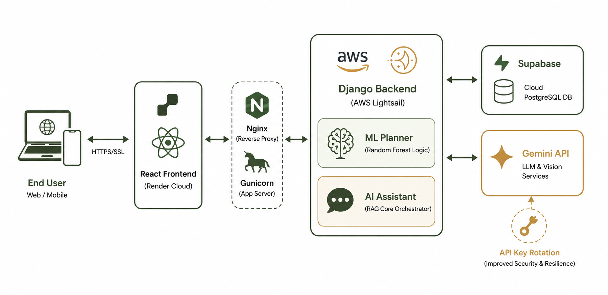
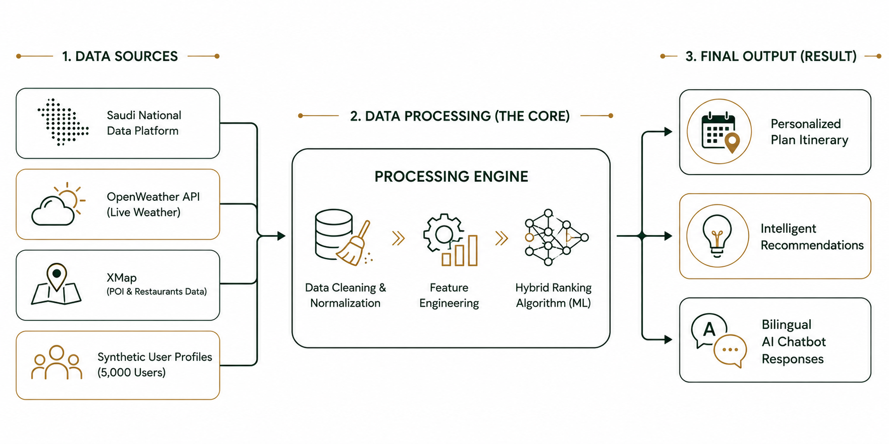
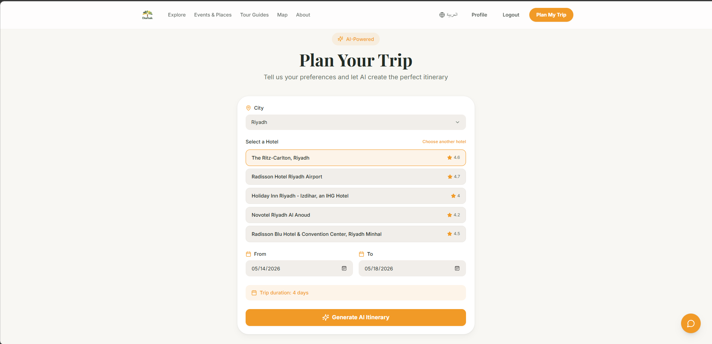
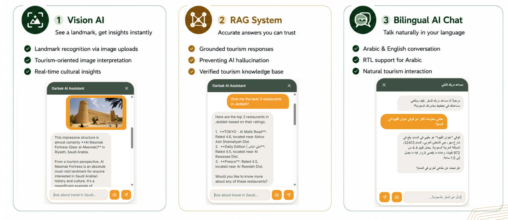

  

# 🌴 Darbak — Smart AI Travel Personalization Platform

Darbak is an AI-powered bilingual tourism platform designed to transform travel planning in Saudi Arabia through intelligent personalization, real-time recommendations, and interactive AI experiences.

Built as a Graduation Project at Shaqra University, Darbak combines Machine Learning, Generative AI, Cloud Computing, and Spatial Intelligence to deliver personalized travel itineraries tailored to each user’s preferences, budget, location, and travel behavior.

---

## ✨ Key Features

### Intelligent Personalization
- Hybrid Ranking Model (Random Forest + Rule-Based Logic)
- Personalized scoring based on user interests and behavior
- Weather-aware recommendation system
- Context-aware planning using popularity, time, and location

### 🗺️ Smart AI Trip Planner
- AI-generated personalized itineraries
- Radius-based optimization for nearby attractions
- Dynamic daily itinerary generation
- Diversity-aware recommendation logic
- Smart city prioritization

### 🤖 Advanced AI Features
- Bilingual AI Chat Assistant (Arabic & English)
- RAG-based conversational AI
- Vision AI landmark recognition
- Image analysis and contextual tourism insights
- Explainable AI recommendation reasoning

### Cloud-Based Architecture
- React Frontend deployed on Render
- Django Backend hosted on AWS Lightsail
- Supabase PostgreSQL Cloud Database
- Gemini API integration
- API Key Rotation for stability and scalability

---

#  System Architecture

The platform follows a cloud-based AI architecture that integrates frontend services, backend intelligence modules, external APIs, and cloud databases.

  

### Architecture Components:
- Frontend: React + TypeScript
- Backend: Django REST Framework
- AI Planner Engine
- RAG AI Assistant
- Hybrid Recommendation Model
- Supabase Cloud Database
- Gemini LLM & Vision APIs
- AWS Lightsail Deployment

---

# 🧠 AI & Machine Learning

## Hybrid Ranking Model

Darbak uses a custom Hybrid Ranking Model combining:

- Random Forest Machine Learning
- Rule-Based Recommendation Logic
- External popularity signals
- Weather and contextual filtering
- Personalized user preference weighting

### Model Performance

Baseline Model:

R² = 0.325

Optimized Random Forest Model:

R² = 0.523

Performance Improvement:

≈ 60.7%

-----

# 📊 Dataset Architecture

The system integrates multiple data sources including:

- Saudi tourism datasets
- Restaurants & POIs
- Hotels & accommodations
- Weather APIs
- Events datasets
- Landmark image datasets
- Synthetic user profiles

### Data Processing Pipeline
- Data Cleaning
- Missing Value Handling
- Normalization
- Feature Engineering
- Hybrid Ranking Processing
- Recommendation Scoring

  

---

# Saudi Vision 2030 Alignment

Darbak supports Saudi Vision 2030 by enabling:
- Digital tourism transformation
- Smart tourism infrastructure
- AI-driven visitor experiences
- Bilingual accessibility
- Intelligent travel assistance

The platform contributes toward:
- Tourism growth
- Digital inclusion
- Smart city experiences
- Enhanced visitor satisfaction

---

# Core Technologies

## Frontend
- React
- TypeScript
- Tailwind CSS
- Framer Motion
- Leaflet Maps

## Backend
- Django
- Django REST Framework
- Python

## AI & Data
- Random Forest
- RAG Architecture
- Gemini API
- Vision AI
- Recommendation Systems

## Cloud & Infrastructure
- AWS Lightsail
- Render
- Supabase
- Nginx
- Gunicorn

---

# Main System Pages

- Home Page
- Personalized Onboarding
- AI Planner
- Itinerary Generator
- Interactive Map
- AI Chat Assistant
- Events & Places
- Tour Guides
- User Profile

---

# Platform Highlights

✅ Personalized AI itineraries  
✅ Bilingual conversational AI  
✅ Real-time contextual recommendations  
✅ Vision AI image analysis  
✅ Cloud-native deployment  
✅ Smart spatial recommendation logic  
✅ Weather-aware planning  
✅ Explainable AI recommendation system  

---

## 🎥 Demo Video

[https://drive.google.com/DARBAK
](https://drive.google.com/file/d/1RJBhZ9oms5JBdfWUYNAMYFfn4OvwLfs-/view?usp=sharing)

---

# Future Work

- Real-time traffic integration
- Voice-based AI assistant
- AR tourism experiences
- Mobile application release
- Live booking integrations
- Reinforcement Learning personalization
- Smart collaborative trip planning

---

# 👩‍💻 Development Team

- Mays Alsalum
- Hailah Albijadi
- Maha Alotaibi

### Supervisor
Dr. Samia Dardouri

### Institution
Shaqra University  
College of Computing and Information Technology  
Computer Science Department

---

# 📸 Platform Preview

## Landing Page

  

---

## 🗺️ Smart AI Planner

  

---

## 🤖 AI Assistant

  

